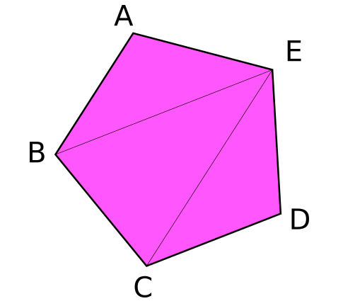

# Notes from Learn-Wgpu & Slides

## Pipeline & Shaders

A pipeline describes all the actions the gpu will perform when acting on a set of data.

You can think of a pipeline as a more robust version of shaders.

Shaders are mini-programs that you send to the gpu to perform operations on your data. There are 3 main types of shader: vertex, fragment, and compute.

## Vertex, fragment... what are those?

A vertex is a point in 3d space (can also be 2d). These vertices are then bundled in groups of 2s to form lines and/or 3s to form triangles.

Most modern rendering uses triangles to make all shapes, from simple shapes (such as cubes) to complex ones (such as people). These triangles are stored as vertices which are the points that make up the corners of the triangles.

We use a vertex shader to manipulate the vertices, in order to transform the shape to look the way we want it.

The vertices are then converted into fragments. Every pixel in the result image gets at least one fragment.

### WGSL

WebGPU Shading Language (opens new window)(WGSL) is the shader language for WebGPU.

### About Attributes (Rust stuff)

You have seen code like `#[derive(Debug)]` before: this type of code is called an attribute. These attributes are small pieces of code that give information to the compiler. They are not easy to create, but they are very easy to use. If you write an attribute with just # then it will affect the code on the next line. But if you write it with #! then it will affect everything in its own space.

`#[warn(unused_variables)]` and `#[warn(dead_code)]` make the compiler be quiet.

## Buffers and Indices

## What is a buffer?

A buffer is a blob of data on the GPU. A buffer is guaranteed to be contiguous, meaning that all the data is stored sequentially in memory. Buffers are generally used to store simple things like structs or arrays, but they can store more complex stuff such as graph structures like trees (provided all the nodes are stored together and don't reference anything outside of the buffer).

## The vertex buffer

Previously we've stored vertex data directly in the vertex shader. While that worked fine to get our bootstraps on, it simply won't do for the long term. The types of objects we need to draw will vary in size, and recompiling the shader whenever we need to update the model would massively slow down our program. Instead, we are going to use buffers to store the vertex data we want to draw. (see lib.rs the Vertex Struct)

Next, we need the actual data that will make up our triangle. Stored in the vertices const.

## The index buffer

An index buffer comes into play when we start using models with a lot of triangles. Consider this pentagon.



It has a total of 5 vertices and 3 triangles. Now if we wanted to display something like this using just vertices we would need something like the following.

```rust
const VERTICES: &[Vertex] = &[
    Vertex { position: [-0.0868241, 0.49240386, 0.0], color: [0.5, 0.0, 0.5] }, // A
    Vertex { position: [-0.49513406, 0.06958647, 0.0], color: [0.5, 0.0, 0.5] }, // B
    Vertex { position: [0.44147372, 0.2347359, 0.0], color: [0.5, 0.0, 0.5] }, // E

    Vertex { position: [-0.49513406, 0.06958647, 0.0], color: [0.5, 0.0, 0.5] }, // B
    Vertex { position: [-0.21918549, -0.44939706, 0.0], color: [0.5, 0.0, 0.5] }, // C
    Vertex { position: [0.44147372, 0.2347359, 0.0], color: [0.5, 0.0, 0.5] }, // E

    Vertex { position: [-0.21918549, -0.44939706, 0.0], color: [0.5, 0.0, 0.5] }, // C
    Vertex { position: [0.35966998, -0.3473291, 0.0], color: [0.5, 0.0, 0.5] }, // D
    Vertex { position: [0.44147372, 0.2347359, 0.0], color: [0.5, 0.0, 0.5] }, // E
];
```

You'll note though that some of the vertices are used more than once. C, and B get used twice, and E is repeated 3 times. Assuming that each float is 4 bytes, then that means of the 216 bytes we use for VERTICES, 96 of them are duplicate data.

Basically, we store all the unique vertices in VERTICES and we create another buffer that stores indices to elements in VERTICES to create the triangles. Here's an example of that with our pentagon.

```rust
// lib.rs
const VERTICES: &[Vertex] = &[
    Vertex { position: [-0.0868241, 0.49240386, 0.0], color: [0.5, 0.0, 0.5] }, // A
    Vertex { position: [-0.49513406, 0.06958647, 0.0], color: [0.5, 0.0, 0.5] }, // B
    Vertex { position: [-0.21918549, -0.44939706, 0.0], color: [0.5, 0.0, 0.5] }, // C
    Vertex { position: [0.35966998, -0.3473291, 0.0], color: [0.5, 0.0, 0.5] }, // D
    Vertex { position: [0.44147372, 0.2347359, 0.0], color: [0.5, 0.0, 0.5] }, // E
];

const INDICES: &[u16] = &[
    0, 1, 4,
    1, 2, 4,
    2, 3, 4,
];
```

## Textures and bind groups

Up to this point, we have been drawing super simple shapes. While we can make a game with just triangles, trying to draw highly detailed objects would massively limit what devices could even run our game. However, we can get around this problem with textures.

Textures are images overlaid on a triangle mesh to make it seem more detailed. There are multiple types of textures such as normal maps, bump maps, specular maps, and diffuse maps. We're going to talk about diffuse maps, or more simply, the color texture.

## TextureViews and Samplers

Now that our texture has data in it, we need a way to use it. This is where a TextureView and a Sampler come in. A TextureView offers us a view into our texture. A Sampler controls how the Texture is sampled. Our program supplies a coordinate on the texture (known as a texture coordinate), and the sampler then returns the corresponding color based on the texture and some internal parameters.

The address_mode_* parameters determine what to do if the sampler gets a texture coordinate that's outside the texture itself. We have a few options to choose from:

- ClampToEdge: Any texture coordinates outside the texture will return the color of the nearest pixel on the edges of the texture.
- Repeat: The texture will repeat as texture coordinates exceed the texture's dimensions.
- MirrorRepeat: Similar to Repeat, but the image will flip when going over boundaries.

## The BindGroup

Bindgroups describes a set of resources that are linked to a pipeline and tell the pipeline where to fetch the data.